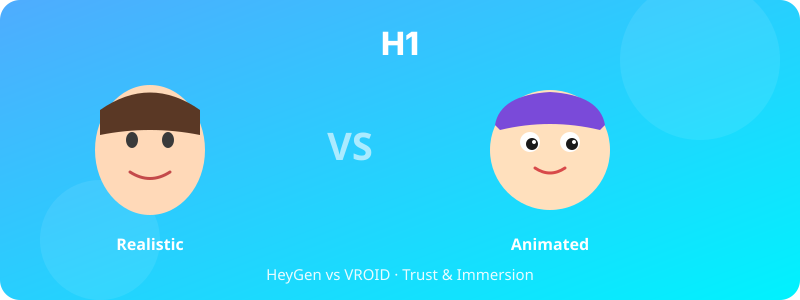

  

# H1. 실사형 vs 애니메이션형 아바타 비교

> 실사형 아바타(HeyGen)는 애니메이션형 아바타(VROID)보다 사용자의 신뢰도와 몰입도를 더 높일 것이다.

---

## 1. 가설 진술 (Hypothesis Statement)

**H1.** 면접 챗봇과의 상호작용에서, 실사형 아바타(HeyGen 기반)를 사용한 집단은 애니메이션형 아바타(VROID 기반)를 사용한 집단보다 봇에 대한 신뢰도(trust), 몰입도(immersion), 사회적 존재감(social presence) 점수가 유의미하게 높을 것이다.

**H1-대립.** 사용자에 따라 실사형 아바타가 'uncanny valley' 효과를 유발하여 오히려 신뢰도·몰입도를 낮출 수 있다.

---

## 2. 이론적 배경 (Theoretical Background)

- **Uncanny Valley 이론** (Mori, 1970): 인간과 매우 유사하지만 완벽하지 않은 형상은 거부감을 유발할 수 있음
- **Social Presence Theory** (Short, Williams, & Christie, 1976): 매개된 상호작용에서 상대의 '실재감'이 신뢰와 만족도에 영향
- **CASA Paradigm** (Computers As Social Actors; Nass & Moon, 2000): 인간은 컴퓨터/아바타에 사회적 규범을 적용

---

## 3. 변수 (Variables)

### 독립변수 (IV)
- **아바타 유형**: 실사형(HeyGen) vs 애니메이션형(VROID) — 2수준

### 종속변수 (DV)
- 신뢰도 척도 (Trust in Automation Scale, Jian et al., 2000) — 12문항
- 몰입도 (Flow Short Scale, Engeser & Rheinberg, 2008)
- 사회적 존재감 (Networked Minds Social Presence Inventory)
- 자기보고식 unheimlich(섬뜩함) 평가

### 통제변수
- 봇의 응답 내용·음성·대화 길이 동일하게 유지
- 참가자의 디지털 리터러시 수준 사전 측정

---

## 4. 실험 설계 (Experimental Design)

- **설계**: Between-subjects, 2-group RCT
- **무선 할당**: 참가자를 실사형 / 애니메이션형 집단에 1:1 배정
- **절차**:
  1. 사전설문 (인구통계, 디지털 리터러시, AI 태도)
  2. 면접 봇과 10분간 상호작용 (모의 자기소개 면접)
  3. 사후설문 (신뢰·몰입·존재감·섬뜩함)
  4. 짧은 자유응답 (어떤 점이 인상적이었는가)

---

## 5. 표본 및 측정 (Sample & Measures)

- **표본**: 대학생·일반 성인 약 N = 120 (집단당 60명, 효과크기 d = 0.5 기준 power = 0.80)
- **모집**: 온라인 공고 + 학내 게시판
- **인센티브**: 모바일 상품권 1만원
- **측정 도구**:
  - Jian Trust Scale (한국어 번안본)
  - Flow Short Scale (FSS-K)
  - Networked Minds Social Presence (단축형)

---

## 6. 분석 방법 (Analysis)

- 주분석: 독립표본 t-검정 또는 Welch's t-test
- 효과크기: Cohen's d
- 보조분석: ANCOVA (디지털 리터러시·연령 통제)
- 탐색분석: 자유응답 텍스트의 BERT 임베딩 + 군집분석 (어떤 측면이 두 집단에서 다르게 언급되는가)

---

## 7. 예상 결과 및 함의 (Expected Results & Implications)

### 예상 결과
- 실사형 집단 > 애니메이션형 집단 (신뢰·존재감)
- 단, 30대 이상에서는 uncanny valley 효과로 차이 축소 가능

### 학술적 함의
- 한국어 사용자 대상 uncanny valley 검증
- 아바타 선택의 실무적 가이드라인 제공

### 실무적 함의
- 면접·상담·교육 봇 개발 시 아바타 유형 결정 근거 제공
- 오픈소스(VROID) 사용의 경제성과 효과 trade-off 평가

---

## 8. 활용 인프라

- 실사형: https://cha-interview-bot-liveavatar-my.vercel.app/ (HeyGen)
- 애니메이션형: VROID 기반 신규 구현 필요

---

## 9. 참고문헌

- Mori, M. (1970). The uncanny valley. *Energy, 7*(4), 33–35.
- Nass, C., & Moon, Y. (2000). Machines and mindlessness. *Journal of Social Issues, 56*(1), 81–103.
- Jian, J. Y., Bisantz, A. M., & Drury, C. G. (2000). Foundations for an empirically determined scale of trust in automated systems. *IJCE, 4*(1), 53–71.

---

*Status: Planning | Priority: ⭐⭐ | Estimated duration: 3 months*
