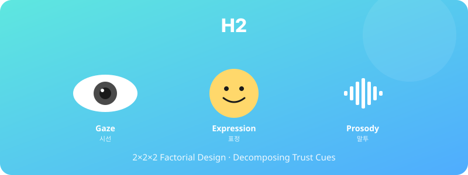

  

# H2. 시선·표정·말투의 신뢰 형성 효과 분해

> 대화형 아바타의 시선·표정·말투 중 시선 일치가 신뢰 형성에 가장 큰 효과를 가질 것이다.

---

## 1. 가설 진술

**H2.** 아바타와의 대화 상황에서, 신뢰 형성에 미치는 효과는 시선 일치(eye contact) > 표정 일치(facial expression) > 말투 일치(prosody) 순으로 클 것이다.

---

## 2. 이론적 배경

- **Gaze and Trust** (Kleinke, 1986): 직접적 시선은 신뢰·호감·주의집중에 핵심 역할
- **Multimodal Communication** (Mehrabian, 1971): 비언어적 신호의 통합 효과
- 신뢰요인-아바타 구성요소 매핑(본 연구팀 선행 연구): https://sdkparkforbi.github.io/cha-interview-bot/trust-components-map.html

---

## 3. 변수

### 독립변수 (IV) — 2×2×2 요인설계
- **시선**: 일치(사용자 응시) vs 불일치(시선 회피)
- **표정**: 일치(맥락 적합) vs 불일치(무표정)
- **말투**: 일치(자연스러운 prosody) vs 불일치(단조로움)

### 종속변수 (DV)
- 신뢰도 (Jian Trust Scale)
- 호감도 (Liking Scale, Reysen, 2005)
- 대화 만족도

---

## 4. 실험 설계

- **설계**: 2×2×2 Within-subjects (또는 Mixed) 요인설계
- **8개 조건** 순서 무선화 (Latin Square)
- 각 조건 약 3분의 짧은 대화 → 즉시 평가
- 피로효과 통제: 조건 간 60초 휴식

---

## 5. 표본 및 측정

- **표본**: N ≈ 64 (within-subjects 기준)
- **측정 도구**: 동일 신뢰·호감 척도 8회 반복 측정
- **추가**: 시선 측정용 webcam eye-tracking (선택사항)

---

## 6. 분석 방법

- 3-way Repeated Measures ANOVA
- 주효과 + 상호작용 검정
- 효과크기: partial η²
- 사후검정: Bonferroni 교정

---

## 7. 예상 결과 및 함의

### 예상 결과
- 시선 일치 주효과가 가장 큰 효과크기를 가질 것
- 시선 × 표정 상호작용 가능 (둘이 모두 일치할 때 시너지)

### 함의
- 아바타 설계의 우선순위 결정 (개발 자원 배분)
- HeyGen·VROID 등 플랫폼 선택 시 어떤 요소를 최적화해야 하는지 가이드

---

## 8. 활용 인프라

- HeyGen 라이브 아바타 봇 + 조건별 변형 버전 8개 구현 필요
- 시선/표정/말투 별도 토글 가능한 백엔드 설계

---

## 9. 참고문헌

- Kleinke, C. L. (1986). Gaze and eye contact: A research review. *Psychological Bulletin, 100*(1), 78–100.
- Mehrabian, A. (1971). *Silent Messages*. Wadsworth.

---

*Status: Planning | Priority: ⭐ | Estimated duration: 4 months*
