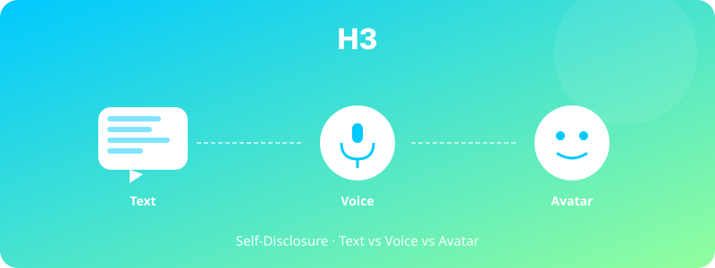

  

# H3. 아바타 유무와 자기개방(Self-Disclosure)

> 아바타가 있는 챗봇은 텍스트 전용·음성 전용 챗봇보다 사용자의 자기개방 수준을 높일 것이다.

---

## 1. 가설 진술

**H3.** 동일한 LLM 백엔드를 사용한 챗봇이라도, **아바타형 > 음성형 > 텍스트형** 순으로 사용자의 자기개방 깊이(depth)와 폭(breadth)이 증가할 것이다.

**대안 가설 (Computers as Confessor)**: 텍스트형 챗봇은 익명성·비판단성 때문에 오히려 자기개방이 더 높을 수 있다(Lucas et al., 2014).

---

## 2. 이론적 배경

- **Self-Disclosure Theory** (Jourard, 1971): 자기개방은 신뢰·친밀감과 양의 상관
- **CASA Paradigm**: 인간은 봇에도 사회적 규범을 적용
- **Computers as Confessor** (Lucas et al., 2014): 봇이 인간 면접관보다 더 깊은 자기개방을 유도하는 역설적 효과

---

## 3. 변수

### 독립변수 (IV)
- 봇 모달리티: **텍스트 / 음성 / 아바타** — 3수준

### 종속변수 (DV)
- 자기개방 깊이 (응답의 주제 친밀도 코딩, 1–5점)
- 자기개방 폭 (다룬 주제 수)
- 응답 길이 (단어 수)
- 사후 친밀감 척도 (IOS Scale, Aron et al., 1992)

### 통제변수
- LLM 백엔드 동일 (Gemma 4.0)
- 동일한 프롬프트·질문 시나리오
- 대화 시간 동일 (15분)

---

## 4. 실험 설계

- **설계**: Between-subjects, 3-group RCT
- **시나리오**: 가벼운 자기소개 → 점진적으로 깊은 주제 (스트레스, 고민, 가치관)
- **응답 코딩**: 두 명의 평정자가 독립 코딩 (Cohen's κ로 신뢰도 확인)

---

## 5. 표본 및 측정

- **표본**: N ≈ 150 (집단당 50명)
- **모집**: 대학생 + 일반 성인
- **측정**:
  - 자기개방 코딩 매뉴얼 (자체 개발 또는 Altman & Taylor 기반)
  - IOS Scale (Inclusion of Other in Self)
  - 사후 자기보고 (얼마나 솔직했는가)

---

## 6. 분석 방법

- One-way ANOVA + Tukey HSD
- 자기개방 깊이는 multilevel model (참가자 내 주제 변화)
- 텍스트 분석: 응답 텍스트의 감정·구체성 점수 (LIWC 한국어판)

---

## 7. 예상 결과 및 함의

### 예상 결과
시나리오 1 (사회적 존재감 효과): 아바타 > 음성 > 텍스트
시나리오 2 (익명성 효과): 텍스트 > 음성 > 아바타

→ **어느 쪽이든 publishable**: 결과 자체가 흥미로운 발견

### 함의
- 디지털 상담·심리치료 봇 설계 가이드
- 면접·HR 봇에서 어떤 모달리티가 후보자의 진솔성을 끌어내는가

---

## 8. 활용 인프라

- 텍스트: https://cha-interview-bot.vercel.app/
- 음성: 위 봇의 음성 모드 (또는 TTS 추가)
- 아바타: https://cha-interview-bot-liveavatar-my.vercel.app/

---

## 9. 참고문헌

- Jourard, S. M. (1971). *Self-Disclosure: An Experimental Analysis of the Transparent Self*. Wiley.
- Lucas, G. M., Gratch, J., King, A., & Morency, L. P. (2014). It's only a computer: Virtual humans increase willingness to disclose. *Computers in Human Behavior, 37*, 94–100.

---

*Status: Planning | Priority: ⭐⭐ | Estimated duration: 4 months*
