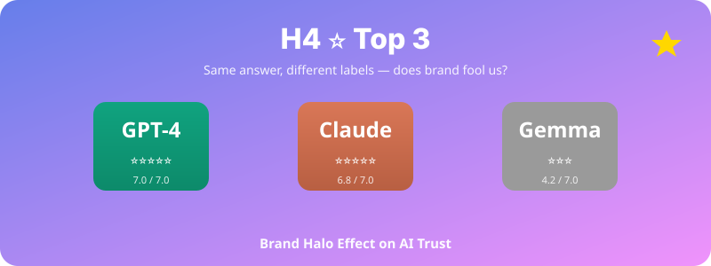

  

# H4. ⭐ LLM 모델 라벨 효과: 오픈소스는 차별받는가?

> 동일한 LLM 응답이라도 모델 라벨(Gemma·GPT·Claude)에 따라 사용자의 신뢰도 평가가 달라질 것이다.

---

## 1. 가설 진술

**H4-1.** 사용자는 동일한 답변에 'GPT-4' 또는 'Claude'라는 라벨이 붙은 경우 'Gemma(오픈소스)' 라벨이 붙은 경우보다 신뢰도·전문성·만족도를 더 높게 평가할 것이다.

**H4-2.** 이 라벨 효과는 사용자의 AI 친숙도가 높을수록 강하게 나타날 것이다.

**H4-3.** 라벨 효과는 응답의 도메인(기술·의료 vs 일상·창작)에 따라 다르게 나타날 것이다.

---

## 2. 이론적 배경

- **Brand Halo Effect** (Leuthesser et al., 1995): 브랜드 명성은 객관적 품질과 무관하게 평가에 영향
- **AI 신뢰의 매개변수**: 신뢰는 인지된 능력(competence)에 영향받음 (Mayer et al., 1995)
- **Source Credibility Theory** (Hovland & Weiss, 1951): 동일한 메시지라도 출처에 따라 수용성이 달라짐
- **최근 연구 갭**: 오픈소스 LLM(Gemma, Llama)의 인지·평가 차별에 대한 실증 연구가 부족

---

## 3. 변수

### 독립변수 (IV)
- **모델 라벨**: GPT-4 / Claude / Gemma (오픈소스) — 3수준
- **도메인**: 기술적 질문 / 일상적 질문 / 창작 질문 — 3수준
- (선택) **실제 모델**: 동일 / 다름 — 조작 점검용

### 종속변수 (DV)
- 응답 신뢰도 (1–7 Likert)
- 응답 전문성 평가
- 응답 만족도
- 추천 의향 ("이 답변을 친구에게 추천하시겠습니까?")
- 응답 재사용 의향

### 조절변수 (Moderator)
- AI 친숙도 (사전 측정)
- 학력·전공
- 오픈소스에 대한 사전 태도

---

## 4. 실험 설계 (핵심!)

### 🔑 핵심 조작 (Deception)
모든 응답은 **실제로는 동일한 모델(Claude 또는 GPT-4)**이 생성한 답변을 사용. 단, 사용자에게는 무작위로 다른 모델 라벨을 보여줌.

### 설계
- **3 (라벨: GPT/Claude/Gemma) × 3 (도메인) Mixed Design**
- 라벨: Between-subjects 또는 Within-subjects (counterbalanced)
- 각 참가자가 9개 응답을 평가 (3 도메인 × 3 라벨, 라벨은 무작위 배정)

### 절차
1. 사전설문 (AI 친숙도, 오픈소스 태도)
2. 9개 질문-응답 쌍 평가 (각 응답마다 라벨 노출 → 평가)
3. **조작 점검**: 라벨이 평가에 영향을 줬다고 느끼는가?
4. **디브리핑**: 모든 응답이 사실 동일 모델임을 공개 + 윤리 동의 재확인

---

## 5. 표본 및 측정

- **표본**: N ≈ 200 (각 라벨 × 도메인 셀당 충분한 관찰)
- **사전 척도**:
  - AI 친숙도 척도 (자체 개발 또는 ATAI Scale)
  - 오픈소스 SW에 대한 태도 척도
- **자극 응답**: 사전 검증된 9개 응답 세트 (질-동등성 확보)

---

## 6. 분석 방법

- 주분석: Mixed-effects ANOVA (라벨 × 도메인 × 참가자 random effect)
- 또는 Linear Mixed Model (lme4) — 응답이 nested
- 효과크기: partial η², Cohen's d
- 조절효과: 라벨 × AI 친숙도 상호작용 검정
- **베이지안 분석 병행** (PLOS One 논문처럼 hierarchical Bayesian model 활용 가능)

---

## 7. 예상 결과 및 함의

### 예상 결과
- GPT/Claude 라벨이 Gemma 라벨보다 신뢰·전문성에서 0.3–0.7점(7점 척도) 정도 더 높음
- 기술적 도메인에서 라벨 효과가 가장 큼
- AI 친숙도 높은 집단에서 라벨 효과 더 강함

### 학술적 함의
- **AI 평가의 편향(bias)** 실증 — 객관적 성능이 아닌 브랜드가 신뢰에 영향
- HCI·소비자 심리학·과학기술학(STS) 교차 기여
- 오픈소스 LLM 평가 연구의 새로운 패러다임

### 실무·정책적 함의
- 기업의 LLM 도입 결정에서 '라벨'이 부당하게 영향
- 오픈소스 생태계 발전을 위한 인식 개선 방향
- AI 마케팅·브랜딩 전략 시사점

---

## 8. 활용 인프라

- 면접봇·통계봇 인프라 활용 (Gemma 4.0 실제 운영 중)
- 응답 표시 페이지에 모델 라벨 토글 추가 구현 필요

---

## 9. 윤리 고려사항

- Deception design이므로 **사후 디브리핑 필수**
- IRB 승인 필수
- 참가자에게 "AI 모델 평가 연구"라는 일반적 정보 제공 후, 사후에 구체적 deception 내용 공개

---

## 10. 참고문헌

- Hovland, C. I., & Weiss, W. (1951). The influence of source credibility on communication effectiveness. *Public Opinion Quarterly, 15*(4), 635–650.
- Mayer, R. C., Davis, J. H., & Schoorman, F. D. (1995). An integrative model of organizational trust. *AMR, 20*(3), 709–734.
- Leuthesser, L., Kohli, C. S., & Harich, K. R. (1995). Brand equity: The halo effect measure. *European Journal of Marketing, 29*(4), 57–66.

---

*Status: Planning | Priority: ⭐⭐⭐ | Estimated duration: 4–5 months | **Top 3 추천***
