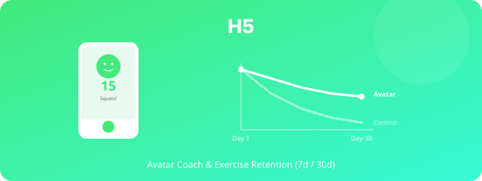

  

# H5. 아바타 코치와 운동앱 Retention

> 아바타 코치가 포함된 운동앱은 코치가 없는 앱보다 7일·30일 retention과 운동 빈도를 높일 것이다.

---

## 1. 가설 진술

**H5-1.** 아바타 코치가 있는 운동앱(스쿼트앱)을 사용한 집단은 코치 없는 동일 앱을 사용한 집단보다 7일 retention이 높을 것이다.

**H5-2.** 30일 retention과 누적 운동 횟수에서도 동일한 효과가 유지될 것이다.

**H5-3.** 운동 동기(자기결정성 이론 기반)는 아바타 코치 집단에서 더 높게 유지될 것이다.

---

## 2. 이론적 배경

- **Self-Determination Theory** (Deci & Ryan, 2000): 자율성·유능감·관계성이 지속 동기를 결정
- **Embodied Conversational Agents** (Cassell et al., 2000): 신체화된 에이전트는 사회적 지원감을 증가
- **Gamification & Avatar in Health Apps**: 아바타가 행동변화 매개변수로 작동

---

## 3. 변수

### 독립변수 (IV)
- **앱 버전**: 아바타 코치 있음 vs 없음 (동일 기능, 코치만 토글)

### 종속변수 (DV)
- 7일·14일·30일 retention rate
- 누적 운동 세션 수
- 1회당 운동 시간
- 사용자 자기효능감 (Exercise Self-Efficacy Scale)
- 운동 즐거움 (PACES, Physical Activity Enjoyment Scale)

---

## 4. 실험 설계

- **설계**: Between-subjects RCT
- **기간**: 30일 (3개월 follow-up 가능)
- **무선 할당**: 가입 시 자동 50:50 배정
- **측정**: 앱 내 로그 + 7일/30일 사후설문

---

## 5. 표본 및 측정

- **표본**: N ≈ 200–300 (dropout 고려)
- **모집**: 운동 시작 의향이 있는 20–40대
- **측정 도구**:
  - 앱 로그 (sessions, duration, frequency)
  - PACES, ESES (자기효능감)
  - 운동 동기 척도 (BREQ-3)

---

## 6. 분석 방법

- Retention 비교: Kaplan-Meier survival analysis + log-rank test
- 운동 빈도: Poisson regression 또는 negative binomial
- 사전-사후 척도: Mixed ANOVA (집단 × 시간)

---

## 7. 예상 결과 및 함의

### 예상 결과
- 아바타 집단의 7일 retention이 대조군 대비 15–25% 높음
- 30일 시점에서 효과는 다소 감소하지만 유의

### 함의
- 디지털 헬스 앱 설계 가이드
- 아바타가 단순 장식이 아닌 행동변화의 매개변수임을 입증
- 의료보험·국가 건강증진 사업 활용 가능성

---

## 8. 활용 인프라

- 참고 앱: 스쿼드앱 (Olive on Google Play)
- 자체 운동앱 구현 + 아바타 모듈 추가 필요
- VROID 아바타 기반 가능

---

## 9. 참고문헌

- Deci, E. L., & Ryan, R. M. (2000). The "what" and "why" of goal pursuits. *Psychological Inquiry, 11*(4), 227–268.
- Cassell, J., Sullivan, J., Prevost, S., & Churchill, E. (2000). *Embodied Conversational Agents*. MIT Press.

---

*Status: Planning | Priority: ⭐⭐ | Estimated duration: 6 months (long-term study)*
