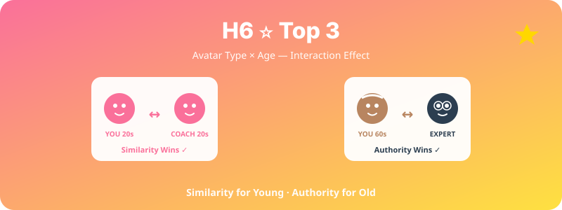

  

# H6. ⭐ 아바타 코치의 유사성·권위성 × 연령 상호작용

> 아바타 코치의 유사성(나와 닮음)은 젊은 층의 운동 지속률을, 권위성(전문가 외형)은 고령층의 운동 지속률을 더 크게 향상시킬 것이다.

---

## 1. 가설 진술

**H6-1.** 젊은 층(20–30대)은 자신과 유사한 아바타 코치(연령·외모 유사)가 있을 때 운동 지속률이 더 높다.

**H6-2.** 고령층(60대 이상)은 권위적 외형의 아바타 코치(전문가 복장, 중년 외모)가 있을 때 운동 지속률이 더 높다.

**H6-3.** 따라서 **연령대 × 아바타 유형 상호작용 효과**가 존재한다.

---

## 2. 이론적 배경

- **Social Identity Theory** (Tajfel & Turner, 1986): 자신과 유사한 대상에 더 강한 동일시
- **Source Credibility Theory** (Hovland & Weiss, 1951): 전문성·신뢰성이 메시지 수용에 영향
- **Proteus Effect** (Yee & Bailenson, 2007): 아바타 외형이 사용자 행동에 영향
- **연령에 따른 권위 인식 차이** (한국 문화권 특수성도 흥미로운 변수)

---

## 3. 변수

### 독립변수 (IV)
- **아바타 유형**: 유사형 (참가자 연령대·외모) vs 권위형 (전문가형, 중년 트레이너) — 2수준
- **연령대**: 20–30대 vs 60대 이상 — 2수준

→ **2×2 요인설계**

### 종속변수 (DV)
- 7일·30일 운동 retention
- 운동 빈도 및 지속시간
- 코치 신뢰도, 호감도
- 운동 자기효능감 변화

---

## 4. 실험 설계

- **설계**: 2 (아바타 유형) × 2 (연령) Between-subjects
- **무선 할당**: 연령 내에서 아바타 유형 무선 배정
- **기간**: 30일

---

## 5. 표본 및 측정

- **표본**: 각 셀당 N ≈ 40 → 총 N ≈ 160
- **모집**:
  - 20–30대: 대학생·직장인
  - 60대 이상: 노인복지관·헬스장 협력
- **측정**: 앱 로그 + 사전·사후 설문

---

## 6. 분석 방법

- 2-way ANOVA (아바타 × 연령)
- 핵심: **상호작용 효과 검정**
- 단순주효과 분석 (각 연령대 내 아바타 효과)
- 효과크기: partial η²

---

## 7. 예상 결과 및 함의

### 예상 결과 (이상적)
- 깔끔한 **disordinal interaction** (cross-over)
- 젊은 층: 유사형 > 권위형
- 고령층: 권위형 > 유사형

### 학술적 함의
- 아바타 맞춤화의 **'one-size-fits-all'은 비효율적**임을 입증
- 연령별 헬스 인터벤션 개인화 근거 제공
- Social Identity vs Authority 이론의 경계 조건 탐색

### 실무적 함의
- 디지털 헬스 앱의 사용자 세그먼트별 아바타 추천 시스템
- 고령자 대상 디지털 헬스케어 시장의 차별화 전략

---

## 8. 활용 인프라

- 스쿼트앱 + 아바타 모듈
- VROID 기반 다중 아바타 자산 (젊은형 / 전문가형) 제작 필요
- 신뢰요인-아바타 매핑 페이지 참고

---

## 9. 참고문헌

- Tajfel, H., & Turner, J. C. (1986). The social identity theory of intergroup behavior. In *Psychology of Intergroup Relations* (pp. 7–24).
- Yee, N., & Bailenson, J. (2007). The Proteus effect: The effect of transformed self-representation on behavior. *Human Communication Research, 33*(3), 271–290.

---

*Status: Planning | Priority: ⭐⭐⭐ | Estimated duration: 5 months | **Top 3 추천***
