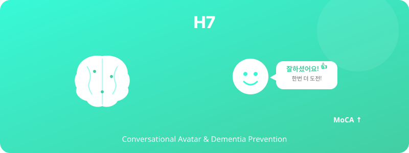

  

# H7. 대화형 아바타 피드백과 치매예방게임 효과

> 대화형 아바타가 격려·피드백을 제공하는 치매예방게임은 정적 게임 대비 신경심리지표의 단기 향상을 가져올 것이다.

---

## 1. 가설 진술

**H7-1.** 대화형 아바타가 피드백을 제공하는 치매예방게임 집단은 동일 게임을 아바타 없이 수행한 집단보다 4주 후 인지기능 측정치(주의·작업기억·실행기능)에서 더 큰 향상을 보일 것이다.

**H7-2.** 게임 지속률과 자율 참여 빈도는 아바타 집단에서 더 높을 것이다.

---

## 2. 이론적 배경

- **인지자극 이론** (Cognitive Stimulation Therapy; Spector et al., 2003): 반복적 인지자극은 경도인지장애·치매에 효과
- **Embodied Conversational Agents in Older Adults**: 고령자가 아바타에 더 강한 사회적 반응 보임
- **자기효능감과 인지수행** (Bandura, 1997): 격려와 피드백이 인지 과제 수행에 영향

---

## 3. 변수

### 독립변수 (IV)
- **피드백 조건**: 대화형 아바타 피드백 vs 텍스트 피드백 vs 피드백 없음 — 3수준

### 종속변수 (DV)
- 신경심리검사 (사전-사후):
  - MoCA (Montreal Cognitive Assessment) — 전반적 인지
  - Stroop test — 실행기능
  - Digit Span — 작업기억
  - Trail Making Test — 주의·실행
- 게임 지속률 (4주간)
- 자율 참여 빈도

---

## 4. 실험 설계

- **설계**: 3-group RCT
- **기간**: 4주 (사전 검사 → 4주 게임 → 사후 검사)
- **권장 횟수**: 주 3회, 회당 20분
- **사전-사후 검사자**: 조건에 blind

---

## 5. 표본 및 측정

- **표본**: N ≈ 90 (집단당 30명)
- **참가자**: 60–75세, MoCA 22점 이상 (경도인지저하 미만)
- **모집**: 노인복지관, 보건소 협력
- **측정**: 표준화된 신경심리검사 + 앱 로그

---

## 6. 분석 방법

- Mixed ANOVA (집단 × 시간[사전-사후])
- 효과크기: partial η², Cohen's d
- 보조: 게임 지속률과 인지 향상의 상관

---

## 7. 예상 결과 및 함의

### 예상 결과
- 아바타 집단의 인지점수 향상이 가장 큼
- 특히 실행기능(Stroop, TMT-B)에서 효과 두드러짐
- 지속률도 아바타 집단이 우수

### 함의
- 노인 디지털 헬스케어에서 아바타의 역할 입증
- 치매 예방 프로그램의 디지털화 근거
- 보건소·치매안심센터 적용 가능성

---

## 8. 활용 인프라

- 현재 운영 중: https://www.aiforalab.com/dementia-prevention-games-v2/
- 아바타 모듈 추가 구현 (VROID 또는 HeyGen)

---

## 9. 참고문헌

- Spector, A., Thorgrimsen, L., Woods, B., et al. (2003). Efficacy of an evidence-based cognitive stimulation therapy programme. *British Journal of Psychiatry, 183*(3), 248–254.
- Bandura, A. (1997). *Self-Efficacy: The Exercise of Control*. Freeman.

---

*Status: Planning | Priority: ⭐⭐ | Estimated duration: 6 months (clinical trial)*
