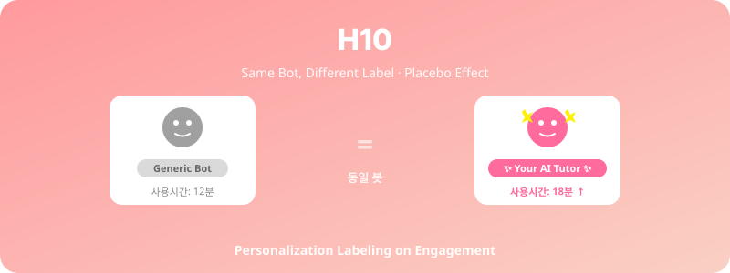

  

# H10. 개인화 라벨링과 학습 몰입

> "당신만을 위한 맞춤형 봇"이라고 라벨링될 때, 학습자의 사용 시간과 몰입도가 증가할 것이다.

---

## 1. 가설 진술

**H10-1.** **실제 봇 기능은 동일**해도 "당신을 위한 맞춤형 튜터"라는 라벨이 붙으면, "일반 튜터봇" 라벨보다 학습자의 사용 시간이 길고 몰입도가 높을 것이다.

**H10-2.** 라벨 효과는 학습자의 자기관련성(self-relevance) 인식을 매개로 작용할 것이다.

---

## 2. 이론적 배경

- **Placebo Effect in HCI** (Kosch et al., 2023): "AI가 도와준다"는 단순 라벨만으로 수행 향상
- **Self-Reference Effect** (Rogers et al., 1977): 자기 관련성이 정보 처리 깊이를 증가
- **Customization vs Personalization** (Sundar & Marathe, 2010): 인식된 맞춤화의 효과

---

## 3. 변수

### 독립변수 (IV) — 핵심 조작
- **라벨링 조건**:
  - "맞춤형": "이 봇은 당신의 학습 패턴을 분석하여 맞춤형으로 응답합니다"
  - "일반": "이 봇은 일반 학습 튜터입니다"
  - (조건은 라벨일 뿐, 실제 봇은 동일)

### 종속변수 (DV)
- 사용 시간 (앱 로그)
- 학습 몰입도 (Flow Short Scale)
- 만족도
- 자기관련성 인식 (매개변수)

---

## 4. 실험 설계

- **설계**: Between-subjects RCT (2 그룹)
- **봇 실제 동작**: 완전히 동일 (deception)
- **기간**: 2주
- **윤리**: 사후 디브리핑 필수

---

## 5. 표본 및 측정

- **표본**: N ≈ 120
- **측정**: 로그 + 사후설문 + 자기관련성 척도

---

## 6. 분석 방법

- t-test (사용 시간, 몰입도)
- 매개분석 (PROCESS macro Model 4): 라벨 → 자기관련성 → 사용 시간

---

## 7. 예상 결과 및 함의

### 예상 결과
- "맞춤형" 라벨 집단의 사용 시간 20–30% 증가
- 자기관련성이 유의한 매개변수

### 함의
- **플라시보 효과**가 AI 시스템에서도 작동
- 마케팅·UX 라벨링의 윤리적 책임
- 진짜 개인화와 라벨링의 효과 비교 (후속 연구 가능)

---

## 8. 활용 인프라

- 통계봇·면접봇 등 기존 봇의 시작 화면 라벨만 변경
- 매우 낮은 구현 비용

---

## 9. 참고문헌

- Kosch, T., et al. (2023). The placebo effect of artificial intelligence in human-computer interaction. *ACM TOCHI, 30*(4), 1–32.
- Sundar, S. S., & Marathe, S. S. (2010). Personalization versus customization: The importance of agency. *Human Communication Research, 36*(3), 298–322.

---

*Status: Planning | Priority: ⭐⭐ | Estimated duration: 2 months (very feasible)*
