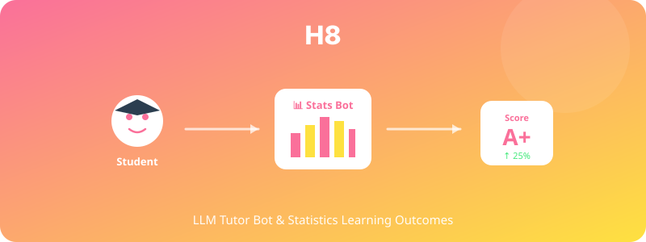

  

# H8. LLM 튜터봇과 통계 학습 효과

> LLM 튜터봇이 도입된 통계 수업은 전통적 수업보다 학습자의 통계 자기효능감과 시험 점수를 높일 것이다.

---

## 1. 가설 진술

**H8-1.** 경영통계봇을 학습 보조도구로 활용한 집단은 활용하지 않은 집단보다 학기말 통계 시험 점수가 유의하게 높을 것이다.

**H8-2.** 통계 자기효능감도 LLM 튜터봇 집단에서 더 크게 향상될 것이다.

**H8-3.** 효과는 학습 초기에 어려움을 겪던 학생일수록 크게 나타날 것이다(상호작용).

---

## 2. 이론적 배경

- **Intelligent Tutoring Systems** (Anderson et al., 1995): 개별화된 튜터링은 평균 1 표준편차의 학습 향상
- **Bloom's 2-Sigma Problem** (Bloom, 1984): 일대일 튜터링의 강력한 효과
- **LLM as Tutor** (Kasneci et al., 2023): 최근 LLM이 ITS의 대안으로 부상

---

## 3. 변수

### 독립변수 (IV)
- **튜터봇 사용**: 사용 집단 vs 미사용 집단 (대조군)

### 종속변수 (DV)
- 통계 시험 점수 (사전-중간-기말)
- 통계 자기효능감 척도 (Statistics Self-Efficacy Scale)
- 통계 불안 (STARS, Statistical Anxiety Rating Scale)
- 과제 완성률 및 질

### 조절변수
- 사전 통계 수준
- 봇 사용 빈도·시간 (mediator로도 분석)

---

## 4. 실험 설계

- **설계**: Quasi-experimental (반 단위 배정) 또는 Cluster RCT
- **기간**: 한 학기 (15주)
- **사용 빈도 측정**: 봇 로그 자동 수집

---

## 5. 표본 및 측정

- **표본**: 경영통계 수강 학생 N ≈ 100–150 (2개 반)
- **측정**:
  - 시험 점수 (객관적)
  - 자기효능감·불안 척도 (사전·중간·사후)
  - 봇 대화 로그 분석

---

## 6. 분석 방법

- Mixed ANOVA (집단 × 시간)
- ANCOVA (사전 점수 통제)
- 매개분석: 봇 사용량 → 자기효능감 → 시험 점수
- 봇 대화의 질적 분석 (텍스트 임베딩 + 군집)

---

## 7. 예상 결과 및 함의

### 예상 결과
- 튜터봇 집단의 시험 점수 0.3–0.5 SD 향상
- 자기효능감 향상이 매개변수로 작용
- 초기 저성취 학생에서 효과 더 큼

### 함의
- 대학 교육에서 LLM 통합 가이드
- 학습 격차 해소 도구로서의 LLM 가능성
- 교수자의 새로운 역할 정의 (튜터 → 코디네이터)

---

## 8. 활용 인프라

- https://cha-statistics-bot-liveavatar.vercel.app/ (경영통계봇)
- 학습 로그 수집 모듈 추가 필요

---

## 9. 참고문헌

- Bloom, B. S. (1984). The 2 sigma problem: The search for methods of group instruction as effective as one-to-one tutoring. *Educational Researcher, 13*(6), 4–16.
- Kasneci, E., Sessler, K., et al. (2023). ChatGPT for good? On opportunities and challenges of large language models for education. *Learning and Individual Differences, 103*, 102274.

---

*Status: Planning | Priority: ⭐⭐ | Estimated duration: 1 semester (4 months)*
