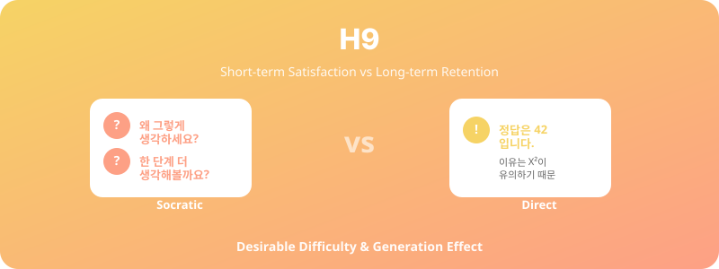

  

# H9. 소크라테스식 봇 vs 직접 응답형 봇

> 소크라테스식 질문형 봇은 직접 응답형 봇보다 학습자의 장기 기억 보유율을 더 높일 것이다.

---

## 1. 가설 진술

**H9-1.** 소크라테스식(질문 유도형) 튜터봇과 학습한 집단은 직접 응답형 봇과 학습한 집단보다 1주 후·4주 후 지연 사후 검사에서 더 높은 기억 보유율을 보일 것이다.

**H9-2.** 단기 학습 만족도는 직접 응답형이 높지만, 장기 학습 효과는 소크라테스식이 우수할 것이다.

**H9-3.** 비판적 사고 점수도 소크라테스식 집단에서 더 크게 향상될 것이다.

---

## 2. 이론적 배경

- **Desirable Difficulty** (Bjork, 1994): 학습 시의 노력이 장기 기억에 도움
- **Generation Effect** (Slamecka & Graf, 1978): 스스로 답을 생성한 정보가 더 잘 기억됨
- **Socratic Method**: 질문을 통한 사고 유도, 비판적 사고 함양

---

## 3. 변수

### 독립변수 (IV)
- **봇 응답 스타일**:
  - 소크라테스식 (질문 → 추가 질문 → 학생 결론)
  - 직접 응답형 (질문 → 즉시 답 제공)

### 종속변수 (DV)
- 즉시 사후 검사 점수
- **지연 사후 검사** (1주, 4주)
- 비판적 사고 척도 (CCTST 또는 단축형)
- 학습 만족도 (즉시)
- 학습 노력 인식 (cognitive load)

---

## 4. 실험 설계

- **설계**: Between-subjects RCT
- **학습 주제**: 동일 (통계 또는 일반 학습 주제)
- **학습 시간**: 동일 (60분)
- **검사 시점**: 즉시 / 1주 후 / 4주 후

---

## 5. 표본 및 측정

- **표본**: N ≈ 100 (집단당 50명)
- **측정**:
  - 학습 효과: 객관식 + 적용 문항
  - 비판적 사고: CCTST 단축형
  - 인지부하: NASA-TLX

---

## 6. 분석 방법

- Mixed ANOVA (집단 × 시점)
- 핵심: **시점 × 집단 상호작용** (장기 효과의 차별성)
- 비판적 사고: 사전-사후 차이 분석

---

## 7. 예상 결과 및 함의

### 예상 결과
- 즉시 검사: 두 집단 유사 또는 직접 응답형이 약간 높음
- 1주·4주 후: **소크라테스식이 유의하게 높음** (cross-over 패턴)
- 만족도: 직접 응답형 > 소크라테스식 (역설적)

### 함의
- LLM 튜터봇 설계의 **단기 만족도-장기 효과 trade-off**
- 교육공학·인지심리학 기여
- 학생 만족도 평가 위주 정책의 위험성 경고

---

## 8. 활용 인프라

- 경영통계봇의 두 가지 프롬프트 버전 운영
- 시스템 프롬프트만 변경하면 됨 → 구현 용이

---

## 9. 참고문헌

- Bjork, R. A. (1994). Memory and metamemory considerations in the training of human beings. In *Metacognition* (pp. 185–205).
- Slamecka, N. J., & Graf, P. (1978). The generation effect. *JEP:HLM, 4*(6), 592–604.

---

*Status: Planning | Priority: ⭐⭐ | Estimated duration: 3 months*
