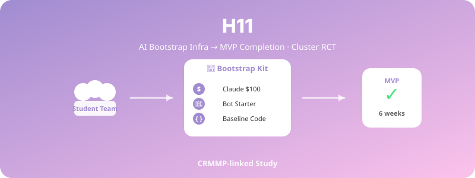

  

# H11. AI 부트스트래핑 인프라와 학생팀 성과

> AI 부트스트래핑 인프라(봇 스타터킷 + Claude Code + 베이스라인 코드)를 제공받은 학생팀은 6주 후 MVP 완성률과 연구가설 검정 수가 더 높을 것이다.

---

## 1. 가설 진술

**H11-1.** AI 부트스트래핑 인프라를 제공받은 학생팀(처치군)은 일반 가이드만 받은 팀(대조군)보다 6주 후 MVP(최소기능제품) 완성률이 더 높을 것이다.

**H11-2.** 처치군은 동일 기간 내 더 많은 연구가설을 형식화하고 검정할 것이다.

**H11-3.** 처치군 학생의 자기효능감·만족도가 더 높을 것이다.

---

## 2. 이론적 배경

- **Scaffolding Theory** (Wood, Bruner, & Ross, 1976): 학습자가 혼자서는 어려운 과제를 지원으로 수행
- **No-Code/Low-Code Movement**: 비기술자도 접근 가능한 개발 도구의 효과
- **Agentic AI for Productivity** (최근 emerging area)

---

## 3. 변수

### 독립변수 (IV)
- **인프라 제공 여부**:
  - 처치군: 봇 스타터킷 + Claude Code 사용법 전수 + Claude $100 + 베이스라인 코드
  - 대조군: 일반 가이드 + 동등 금액의 자유 사용 크레딧

### 종속변수 (DV)
- **MVP 완성률** (6주 후, 외부 평가자가 rubric으로 평가)
- 형식화된 연구가설 수
- 실제 검정 수행한 가설 수
- 자기효능감 (개발·연구 각각)
- 팀 만족도

---

## 4. 실험 설계

- **설계**: Cluster RCT (팀 단위 무선 배정)
- **기간**: 6주 (CRMMP 일정과 연동)
- **모집**: 공모전 참여 팀

---

## 5. 표본 및 측정

- **표본**: 팀 N ≈ 20–30 (각 팀 2–3명)
- **측정**:
  - 외부 평가자 rubric (MVP 완성도)
  - 가설 문서 분석
  - 자기효능감 척도

---

## 6. 분석 방법

- 팀 단위 t-test 또는 Mann-Whitney U
- 다층모형 (학생 within 팀)
- 외부 평가자 간 신뢰도 (ICC)

---

## 7. 예상 결과 및 함의

### 예상 결과
- 처치군의 MVP 완성률 1.5–2배
- 가설 검정 수도 2배 이상

### 함의
- **AI 인큐베이터의 효과 증거**
- 교육·창업 정책에서 AI 인프라 투자의 ROI
- 박대근 교수 플랫폼의 외부 검증

---

## 8. 활용 인프라

- 사업계획서(AI 학생창업 자동화 플랫폼)의 실행 버전
- 봇 스타터킷·베이스라인 코드 패키징 필요

---

## 9. 참고문헌

- Wood, D., Bruner, J. S., & Ross, G. (1976). The role of tutoring in problem solving. *Journal of Child Psychology and Psychiatry, 17*(2), 89–100.

---

*Status: Planning | Priority: ⭐⭐ | Estimated duration: 6 weeks (CRMMP 연계)*
