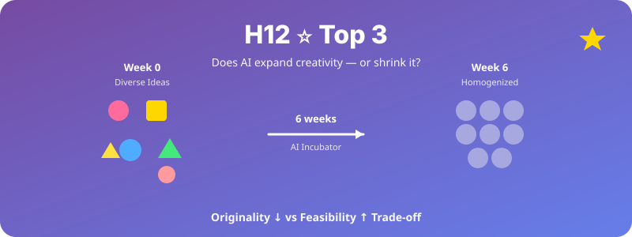

  

# H12. ⭐ AI 인큐베이터와 아이디어 균질화

> AI 인큐베이터 사용 기간이 길어질수록 학생 아이디어의 독창성은 감소하고 유사성은 증가할 것이다.

---

## 1. 가설 진술

**H12-1.** AI 인큐베이터(LLM 기반 아이디어 발굴·개발 지원)를 더 오래 사용한 학생팀일수록, 산출 아이디어의 **의미적 유사성(semantic similarity)**이 증가할 것이다.

**H12-2.** 동시에 아이디어의 **독창성(originality)**과 **다양성(diversity)** 지표는 감소할 것이다.

**H12-3.** 단, **실현가능성(feasibility)**과 **완성도(execution quality)**는 증가할 것이다.

→ 즉, **창의성-효율성 trade-off**가 존재한다.

---

## 2. 이론적 배경

- **AI Homogenization Concern**:
  - Doshi & Hauser (2024, *Science Advances*): ChatGPT 사용이 개인 창의성은 향상시키지만 집단 다양성은 감소시킴
  - Anderson et al. (2024, arXiv): LLM 보조 글쓰기의 균질화 현상
- **Variety vs Quality Trade-off** (Boden, 2004)
- **Group Convergence in CMC** (Postmes et al., 2000)

---

## 3. 변수

### 독립변수 (IV)
- **AI 인큐베이터 사용 기간**: 0주 / 2주 / 4주 / 6주 (종단)
- **사용 강도** (시간/주, 대화 수)

### 종속변수 (DV)
- **의미적 유사성**: 팀 간 아이디어의 BERT 임베딩 cosine similarity
- **독창성**: 외부 평가자의 1–7 점수 + novelty detection 알고리즘
- **다양성**: 팀 내 산출 아이디어들의 분산
- **실현가능성·완성도**: rubric 평가

---

## 4. 실험 설계

- **설계**: Longitudinal observational + Quasi-experimental
- **데이터 소스**: AI 인큐베이터 플랫폼 자체 (실제 운영 데이터)
- **2주마다 아이디어 산출물 수집**

### 대조군 설정 (가능 시)
- 전통적 인큐베이터 (LLM 미사용) vs AI 인큐베이터

---

## 5. 표본 및 측정

- **표본**: 팀 N ≈ 30–50 (시간 흐름 추적)
- **측정**:
  - 아이디어 텍스트 (자동 수집)
  - 외부 평가자 3명 (평가자 간 신뢰도 ICC ≥ 0.7)
  - LLM 사용 로그

---

## 6. 분석 방법

- **시계열 분석**: 시간에 따른 유사성·독창성 변화
- **Pairwise cosine similarity** matrix 분석
- **다층모형**: 시간 × 팀 (random effect)
- **텍스트 분석**: BERTopic으로 아이디어 토픽 추적
- **베이지안 변화점 분석**: 어느 시점에서 균질화가 시작되는가

---

## 7. 예상 결과 및 함의

### 예상 결과
- 시간 경과에 따라 팀 간 유사성 증가 (선형 또는 S-curve)
- 독창성은 초기 약간 증가 후 감소 가능
- 실현가능성은 꾸준히 증가
- **명백한 trade-off 패턴** 관찰

### 학술적 함의
- **현재 가장 hot한 학계 이슈** (Nature, Science 계열에서 활발)
- AI와 인간 창의성에 대한 심층 기여
- 교육공학·창의성 연구·HCI 다학제 기여

### 정책·실무적 함의
- AI 인큐베이터·교육의 **숨겨진 비용** 인식
- 다양성 보존을 위한 설계 가이드라인 (예: 의도적 perturbation, 다양한 모델 사용)
- AI 사용 윤리 가이드의 새로운 차원

---

## 8. 활용 인프라

- AI 학생창업 자동화 플랫폼(사업계획서) 실행 시 자동으로 데이터 축적
- 별도 데이터 수집 부담 적음

---

## 9. 참고문헌

- Doshi, A. R., & Hauser, O. P. (2024). Generative AI enhances individual creativity but reduces the collective diversity of novel content. *Science Advances, 10*(28), eadn5290.
- Anderson, B. R., Shah, J. H., & Kreminski, M. (2024). Homogenization effects of large language models on human creative ideation. *Creativity and Cognition*.
- Boden, M. A. (2004). *The Creative Mind: Myths and Mechanisms* (2nd ed.). Routledge.

---

*Status: Planning | Priority: ⭐⭐⭐ | Estimated duration: 6–12 months | **Top 3 추천***
