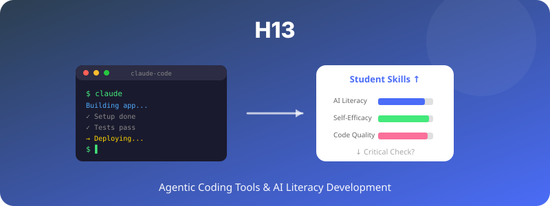

  

# H13. Agentic Coding Tool과 AI 리터러시

> Claude Code와 같은 agentic coding tool 사용 경험은 학생의 AI 리터러시와 개발 자기효능감을 향상시킬 것이다.

---

## 1. 가설 진술

**H13-1.** Claude Code를 활용한 학생은 일반 LLM(채팅 기반)만 사용한 학생보다 4주 후 AI 리터러시 점수와 개발 자기효능감이 더 높을 것이다.

**H13-2.** 코드 산출물의 질(정확성·구조화·문서화)도 더 우수할 것이다.

**H13-3.** 단, AI 의존도 인식이 높아져 비판적 점검 행동은 감소할 수 있다(대안 가설).

---

## 2. 이론적 배경

- **AI Literacy** (Long & Magerko, 2020): AI를 이해·평가·협업하는 능력
- **Augmented Cognition** (Engelbart, 1962): 도구가 인간 능력을 확장
- **Cognitive Offloading 위험** (Risko & Gilbert, 2016): 도구 의존이 비판적 사고를 약화시킬 수 있음

---

## 3. 변수

### 독립변수 (IV)
- **도구 조건**:
  - Claude Code (agentic) 집단
  - 일반 LLM 채팅 (Claude/GPT 채팅 인터페이스) 집단
  - LLM 미사용 집단 (대조군)

### 종속변수 (DV)
- AI 리터러시 척도 (MAILS 또는 ATTARI-12)
- 개발 자기효능감
- 코드 산출물 평가 (rubric)
- AI 의존도 + 비판적 점검 행동

---

## 4. 실험 설계

- **설계**: 3-group quasi-experimental
- **기간**: 4주 미니 프로젝트
- **과제**: 동일 (예: 간단한 데이터 분석 봇 만들기)
- **측정**: 사전·사후 척도 + 산출물

---

## 5. 표본 및 측정

- **표본**: N ≈ 60 (집단당 20명)
- **측정**:
  - MAILS (Modular AI Literacy Scale)
  - 자기효능감 척도
  - 외부 평가자의 코드 rubric

---

## 6. 분석 방법

- One-way ANOVA + Tukey HSD
- ANCOVA (사전 코딩 경험 통제)
- 매개분석: 도구 → 사용 경험 → 리터러시

---

## 7. 예상 결과 및 함의

### 예상 결과
- Claude Code 집단의 자기효능감과 코드 질 우수
- 리터러시는 채팅형 LLM 집단과 비슷할 수도 (성찰 시간이 적기 때문)
- 비판적 점검 행동에서 흥미로운 trade-off

### 함의
- Agentic AI 도구의 교육적 효과 실증
- 코딩 교육 패러다임 전환
- "AI에게 위임"의 학습 비용 정의

---

## 8. 활용 인프라

- Claude Code 학생 라이선스 (Claude $100 크레딧)
- 일반 LLM 채팅 (동일 모델)
- 산출물 저장소 (GitHub Classroom 등)

---

## 9. 참고문헌

- Long, D., & Magerko, B. (2020). What is AI literacy? Competencies and design considerations. *CHI '20*.
- Risko, E. F., & Gilbert, S. J. (2016). Cognitive offloading. *Trends in Cognitive Sciences, 20*(9), 676–688.

---

*Status: Planning | Priority: ⭐⭐ | Estimated duration: 2 months*
