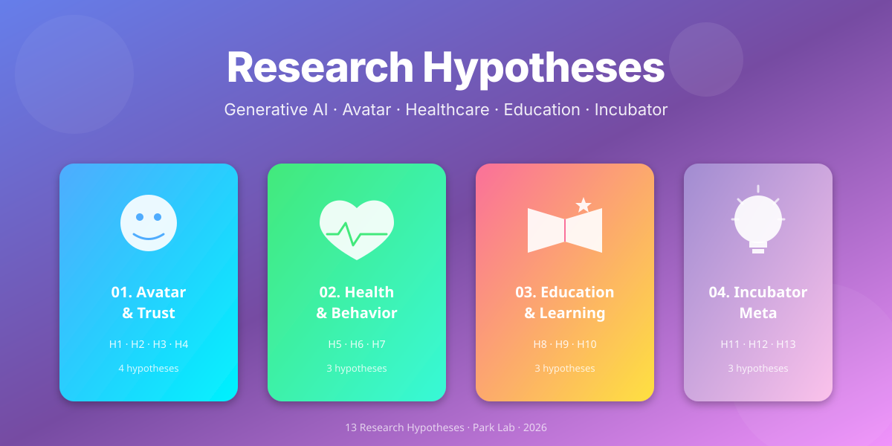

  

# 🧪 Research Hypotheses

> **생성형 AI 기반 서비스·인큐베이터 플랫폼을 활용한 인간행동·교육·헬스케어·창업 연구**

본 리포지토리는 박대근 교수 연구팀이 구축한 LLM·아바타 기반 서비스 플랫폼을 실험 인프라로 활용하여, 인간-AI 상호작용·행동변화·학습효과·창의성에 대한 가설을 검정하기 위한 **연구가설 모음집**입니다.

---

## 📚 연구 영역 및 가설 목록

### 1️⃣ 아바타·신뢰(Trust) 영역

| 코드 | 가설 | 링크 |
|------|------|------|
| **H1** | 실사형 아바타는 애니메이션형 아바타보다 신뢰도·몰입도를 더 높일 것이다 | [📄](01-avatar-trust/H1-realistic-vs-animated.md) |
| **H2** | 시선·표정·말투 중 시선 일치가 신뢰 형성에 가장 큰 효과를 가질 것이다 | [📄](01-avatar-trust/H2-gaze-expression-tone.md) |
| **H3** | 아바타가 있는 챗봇은 자기개방(self-disclosure) 수준을 높일 것이다 | [📄](01-avatar-trust/H3-self-disclosure.md) |
| **H4** ⭐ | 동일 LLM 응답이라도 모델 라벨(Gemma/GPT/Claude)에 따라 신뢰도가 달라질 것이다 | [📄](01-avatar-trust/H4-llm-label-effect.md) |

### 2️⃣ 헬스케어·행동변화 영역

| 코드 | 가설 | 링크 |
|------|------|------|
| **H5** | 아바타 코치가 있는 운동앱은 retention과 운동 빈도를 높일 것이다 | [📄](02-healthcare/H5-avatar-coach-retention.md) |
| **H6** ⭐ | 아바타 코치의 유사성/권위성 효과는 연령대에 따라 다를 것이다 | [📄](02-healthcare/H6-similarity-authority.md) |
| **H7** | 대화형 아바타 피드백은 치매예방게임의 신경심리지표를 향상시킬 것이다 | [📄](02-healthcare/H7-dementia-game.md) |

### 3️⃣ 교육·학습 영역

| 코드 | 가설 | 링크 |
|------|------|------|
| **H8** | LLM 튜터봇은 통계 자기효능감과 시험 점수를 높일 것이다 | [📄](03-education/H8-stats-tutor-bot.md) |
| **H9** | 소크라테스식 질문형 봇은 직접 응답형 봇보다 기억 보유율을 높일 것이다 | [📄](03-education/H9-socratic-vs-direct.md) |
| **H10** | "맞춤형 봇" 라벨링은 사용 시간과 몰입도를 증가시킬 것이다 | [📄](03-education/H10-personalization-label.md) |

### 4️⃣ AI 인큐베이터 메타 연구 영역

| 코드 | 가설 | 링크 |
|------|------|------|
| **H11** | AI 부트스트래핑 인프라는 학생팀의 MVP 완성률과 가설 검정 수를 높일 것이다 | [📄](04-incubator-meta/H11-bootstrap-infra.md) |
| **H12** ⭐ | AI 인큐베이터 사용 기간이 길수록 학생 아이디어는 균질화될 것이다 | [📄](04-incubator-meta/H12-creativity-homogenization.md) |
| **H13** | Agentic Coding Tool 사용 경험은 학생의 AI 리터러시를 향상시킬 것이다 | [📄](04-incubator-meta/H13-agentic-coding.md) |

⭐ = "재미있는 논문" Top 3 추천 가설

---

## 🏗️ 활용 가능한 실험 인프라

| 플랫폼 | URL | 용도 |
|--------|-----|------|
| 면접 챗봇 (텍스트) | https://cha-interview-bot.vercel.app/ | H3, H4 |
| 라이브 아바타 면접봇 (HeyGen) | https://cha-interview-bot-liveavatar-my.vercel.app/ | H1, H2, H3 |
| 경영통계봇 | https://cha-statistics-bot-liveavatar.vercel.app/ | H8, H9, H10 |
| 치매예방게임 | https://www.aiforalab.com/dementia-prevention-games-v2/ | H7 |
| 신뢰요인-아바타 매핑 | https://sdkparkforbi.github.io/cha-interview-bot/trust-components-map.html | H1, H2 |

---

## 📝 각 가설 문서의 구조

모든 가설은 동일한 연구설계서 템플릿을 따릅니다:

1. **가설 진술** (Hypothesis Statement)
2. **이론적 배경** (Theoretical Background)
3. **독립변수 / 종속변수** (IV / DV)
4. **실험 설계** (Experimental Design)
5. **표본 및 측정** (Sample & Measures)
6. **분석 방법** (Analysis)
7. **예상 결과 및 함의** (Expected Results & Implications)
8. **참고문헌** (References)

---

## 🎯 우선 추진 추천 (Top 3)

> **🥇 H4** — 오픈소스 LLM 차별 가설 (단순 설계 + 사회적 함의 큼)
>
> **🥈 H12** — AI 인큐베이터 창의성 균질화 (학계 핫이슈 직결)
>
> **🥉 H6** — 아바타 유사성×연령 상호작용 (깔끔한 결과 예측 가능)

---

## 📬 Contact

- **PI**: 박대근 교수
- **Co-researcher**: 김정민 (AI헬스케어융합전공, 학석연계과정)

---

*Last updated: 2026-05-21*
